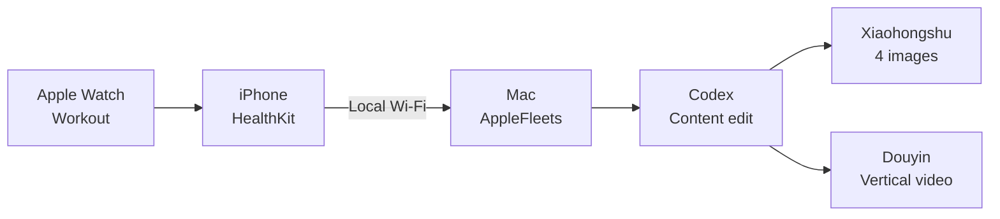

<p align="center">
  
</p>

<p align="center">
  Turn an Apple Watch run into Xiaohongshu cards, a Douyin video, and platform-specific copy—edited by Codex on your Mac.
</p>

<p align="center">
  <a href="https://github.com/JosephJagger/applefleets/actions/workflows/build.yml"></a>
  <a href="LICENSE"></a>
  
  
  
</p>

<p align="center">
  <strong>English</strong> · <a href="README.zh-CN.md">Chinese</a>
</p>

---

## What it creates

| Output | Contents |
| --- | --- |
| Xiaohongshu | Four 1080 × 1440 PNG cards plus a title, post, and hashtags |
| Douyin | One 1080 × 1920, 12-second MP4 plus a hook, caption, and hashtags |
| Edit record | The prompt, raw Codex response, final content plan, and workout summary |

Codex analyzes distance, pace, duration, heart rate, and kilometer splits. Its cover title and closing insight appear in the rendered images and video, so it does more than write a detached caption.

## How it works



- Keep using Apple's built-in Workout app; no watchOS app is required.
- GPS coordinates stay on the iPhone and never go to the Mac or Codex.
- Generated files stay in `~/Movies/AppleFleets`.
- Publishing remains a manual review step.

## Quick start

> [!NOTE]
> The iPhone app must be built with Xcode because this prototype reads HealthKit. The full first-time setup takes about 30–60 minutes.

With Xcode, Homebrew, and Codex already installed:

```bash
git clone https://github.com/JosephJagger/applefleets.git
cd applefleets
brew install xcodegen
xcodegen generate
open AppleFleets.xcodeproj
```

Configure signing in Xcode, install the app on your iPhone, then build the Mac tool:

```bash
cd Mac
swift build -c release
.build/release/applefleets demo --codex
```

Need every click explained? Continue with the guide below.

## First-time setup

### 1. Prepare the Apple devices

You need:

- an Apple Watch and iPhone that already save runs to Apple Health;
- an iPhone running iOS 17 or later;
- a Mac running macOS 14 or later;
- an Apple ID and a cable for the first iPhone installation.

Open the App Store on the Mac, install **Xcode**, open it once, accept the license, and let it install additional components. Confirm the installation in Terminal:

```bash
xcode-select -p
xcodebuild -version
```

The second command should print an Xcode version.

### 2. Download the project

Use the green **Code** button on this page and choose **Open with GitHub Desktop**, or run:

```bash
cd ~/Documents
git clone https://github.com/JosephJagger/applefleets.git
cd applefleets
```

The remaining examples assume the project is in `~/Documents/applefleets`. Replace that path if you chose another location.

### 3. Install XcodeGen

Check for Homebrew:

```bash
brew --version
```

If Terminal cannot find `brew`, install it from [brew.sh](https://brew.sh/), then run:

```bash
brew install xcodegen
cd ~/Documents/applefleets
xcodegen generate
open AppleFleets.xcodeproj
```

### 4. Configure iPhone signing

1. Connect and unlock the iPhone. Tap **Trust** if prompted.
2. In Xcode, select the blue **AppleFleets** project in the left sidebar.
3. Under **TARGETS**, select **AppleFleets**.
4. Open **Signing & Capabilities**.
5. Enable **Automatically manage signing**.
6. Select your Apple ID under **Team**.
7. Set a unique **Bundle Identifier**, such as `com.yourname.applefleets`.

If your Apple ID is missing, open **Xcode → Settings → Accounts**, click `+`, and sign in.

### 5. Install the iPhone app

1. Select the connected iPhone from the device menu at the top of Xcode.
2. Click the triangular Run button or press `Command + R`.
3. If iPhone requests Developer Mode, enable it under **Settings → Privacy & Security → Developer Mode**, restart the phone, and run again.
4. On first launch, allow the requested Health read permissions and Local Network access.

The app is ready when it displays a workout or opens its demo screen.

### 6. Sign in to Codex CLI

Check whether Codex CLI is available:

```bash
codex --version
```

If it is missing, follow the [official Codex CLI setup guide](https://help.openai.com/en/articles/11096431), or install it after installing Node.js:

```bash
npm install -g @openai/codex
```

Sign in and verify the session:

```bash
codex login
codex login status
```

### 7. Render the demo

The demo proves that Codex and video rendering work before you connect the iPhone:

```bash
cd ~/Documents/applefleets/Mac
swift build -c release
.build/release/applefleets demo --codex
```

Finder opens the result folder when rendering finishes. Check for:

```text
xiaohongshu-01.png      xiaohongshu.md
xiaohongshu-02.png      douyin.md
xiaohongshu-03.png      content-plan.json
xiaohongshu-04.png      codex-input.md
douyin-vertical.mp4     codex-output.json
workout.json
```

### 8. Pair the iPhone and Mac

1. Put the iPhone and Mac on the same Wi-Fi network.
2. Open AppleFleets on the iPhone and keep it visible.
3. In the first connection card, note the local address and six-digit code.
4. Replace the example values below with the values shown on the phone:

```bash
cd ~/Documents/applefleets/Mac
.build/release/applefleets pair http://192.168.1.20:8765 123456
.build/release/applefleets fetch
```

Pairing works when `fetch` prints a workout containing fields such as `distanceMeters` and `heartRate`.

### 9. Enable automatic generation

On a regular network, run:

```bash
cd ~/Documents/applefleets
./scripts/install-mac-agent.sh --codex
```

Allow incoming network connections if macOS asks. The agent now starts at Mac login and checks for a new workout every 15 seconds.

### Keep a VPN enabled

**Keep the VPN connected.** Codex should continue through the VPN while private-network traffic to the iPhone goes directly over Wi-Fi.

1. Enable an option named **Allow LAN**, **Bypass LAN**, or **Exclude private networks** in the VPN application.
2. In rule mode, route these private network ranges through `DIRECT`:

```text
192.168.0.0/16
10.0.0.0/8
172.16.0.0/12
```

3. After adding the direct rules, install the background agent normally:

```bash
cd ~/Documents/applefleets
./scripts/install-mac-agent.sh --codex
```

If the VPN application also exposes a local **HTTP proxy port**, you can route only Codex HTTPS traffic to that port. `http://127.0.0.1:7890` is an example; use the port shown by your application:

```bash
cd ~/Documents/applefleets
./scripts/install-mac-agent.sh --codex --proxy http://127.0.0.1:7890
```

This option adds `NO_PROXY` for local and private addresses. Use the same proxy for a manual demo:

```bash
cd ~/Documents/applefleets/Mac
HTTPS_PROXY=http://127.0.0.1:7890 NO_PROXY=localhost,127.0.0.1,.local .build/release/applefleets demo --codex
```

If the VPN only provides full-tunnel mode and has no HTTP proxy port, the `DIRECT` rules and normal installer command are sufficient.

## Everyday use

1. Record and save a run with Apple's Workout app on the Watch.
2. Wait for the workout to appear in Health on the iPhone.
3. Open AppleFleets and tap the button in the top-right corner to reload the latest workout.
4. Keep the Mac awake for a few minutes.
5. Open the output folder:

```bash
open ~/Movies/AppleFleets
```

6. Review the images, video, and captions, then AirDrop them to the iPhone for publishing.

## Verify the Codex edit

Open `content-plan.json` in a generated folder:

```json
"editor": "codex"
```

That value confirms Codex created the content plan. A value of `local-template` means the Codex call failed and the offline fallback kept the workflow running.

| File | Purpose |
| --- | --- |
| `codex-input.md` | Workout metrics and editorial instructions sent to Codex |
| `codex-output.json` | Raw structured response from Codex |
| `content-plan.json` | Final plan used by the renderer |
| `xiaohongshu.md` | Ready-to-copy Xiaohongshu post |
| `douyin.md` | Ready-to-copy Douyin caption |

## Troubleshooting

<details>
<summary><strong>Xcode shows a signing error</strong></summary>

Open **AppleFleets → TARGETS → AppleFleets → Signing & Capabilities**. Confirm that Team contains your Apple ID, automatic signing is enabled, and the Bundle Identifier is unique.

</details>

<details>
<summary><strong>The workout does not appear</strong></summary>

Confirm the run appears under **Health → Browse → Activity → Workouts**. Return to AppleFleets and use the top-right reload button. If needed, enable permissions under **Settings → Privacy & Security → Health → AppleFleets**.

</details>

<details>
<summary><strong>Pairing fails</strong></summary>

Keep AppleFleets visible on the iPhone. Confirm both devices use the same Wi-Fi, Local Network access is enabled, and the address and current code exactly match the phone. If the Mac uses a proxy or VPN, leave it running and add `DIRECT` rules for the three private network ranges listed above.

</details>

<details>
<summary><strong>A workout does not generate content</strong></summary>

Watch the agent log, then reload the workout on the iPhone:

```bash
tail -f "$HOME/Library/Application Support/AppleFleets/logs/watch.log"
```

Press `Control + C` to leave the log. Reinstall the agent if needed:

```bash
cd ~/Documents/applefleets
./scripts/uninstall-mac-agent.sh
./scripts/install-mac-agent.sh --codex
```

When using a local HTTP proxy port, add the `--proxy` option shown in the VPN section above.

</details>

<details>
<summary><strong>Codex did not edit the content</strong></summary>

```bash
codex login status
cd ~/Documents/applefleets/Mac
.build/release/applefleets demo --codex
```

Read the Terminal error and inspect `content-plan.json` in the generated folder.

</details>

## Uninstall the background agent

```bash
cd ~/Documents/applefleets
./scripts/uninstall-mac-agent.sh
```

## Development

```bash
# Generate and build the iPhone project
xcodegen generate
xcodebuild build -project AppleFleets.xcodeproj -scheme AppleFleets \
  -destination 'generic/platform=iOS Simulator' CODE_SIGNING_ALLOWED=NO

# Test the Mac tool
cd Mac
swift test
```

Read [Architecture](docs/ARCHITECTURE.md), [Contributing](CONTRIBUTING.md), and [Third-party notices](THIRD_PARTY_NOTICES.md).

## License

AppleFleets is available under the [MIT License](LICENSE). Third-party components retain the licenses listed in [THIRD_PARTY_NOTICES.md](THIRD_PARTY_NOTICES.md).
