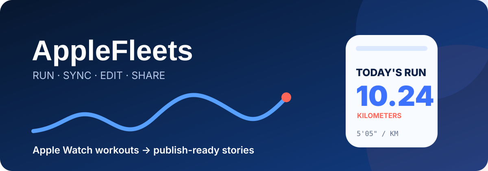
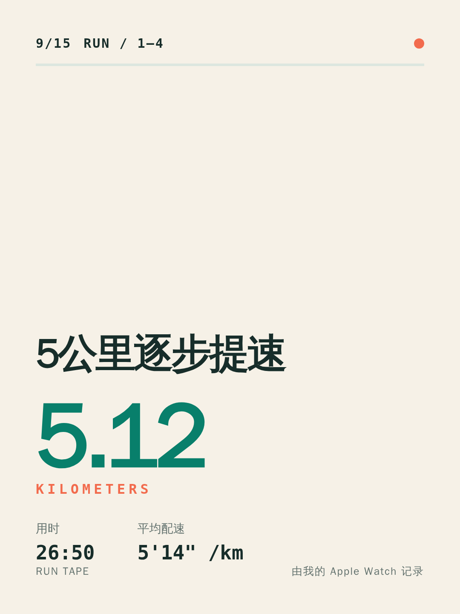
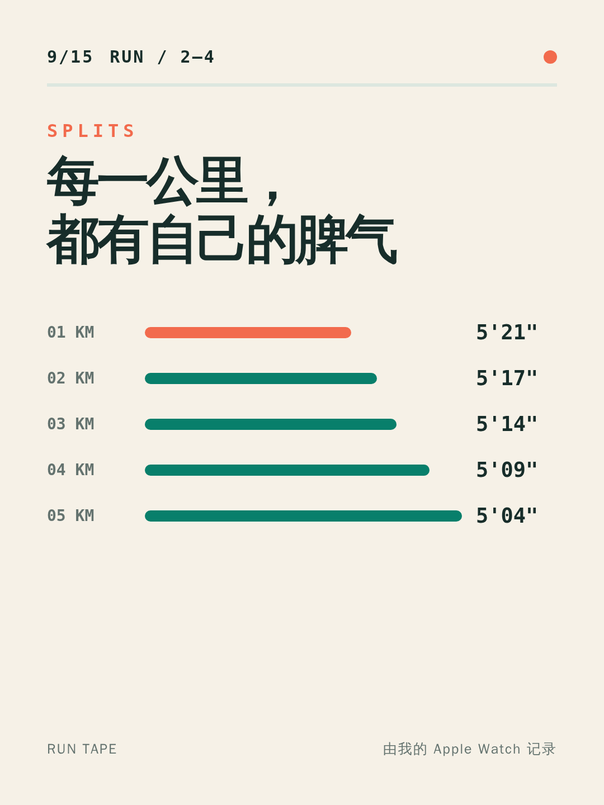
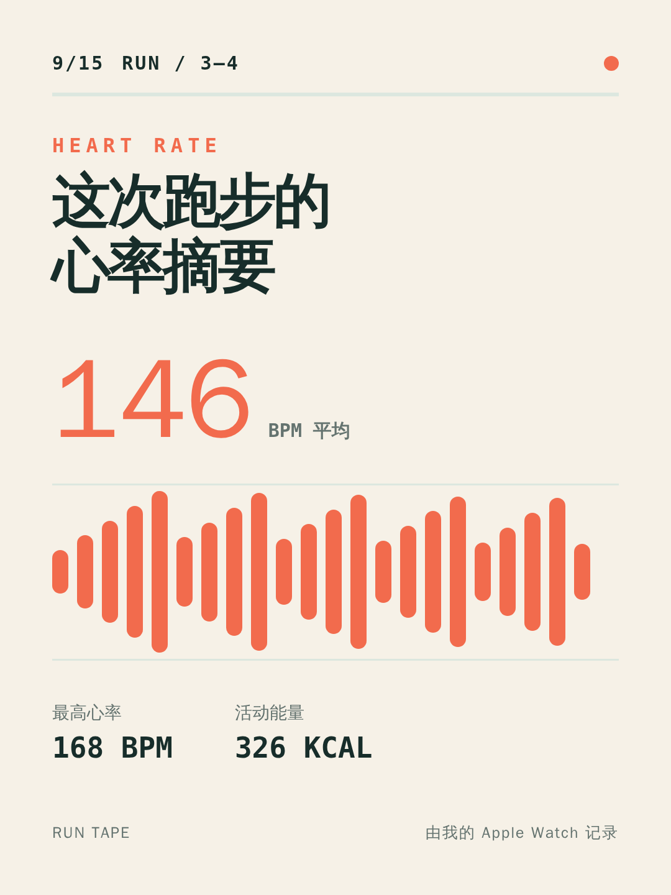
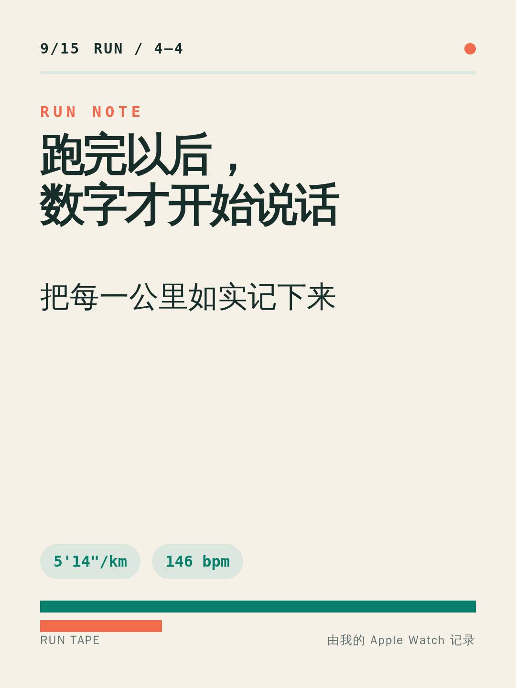

<p align="center">
  
</p>

<p align="center">Apple Watch records the run. iPhone reads it. Linux Codex writes the copy and the Linux renderer returns finished media to the phone.</p>

<p align="center">
  <a href="https://github.com/JosephJagger/applefleets/actions/workflows/build.yml"></a>
  <a href="LICENSE"></a>
  
</p>

<p align="center"><strong>English</strong> · <a href="README.zh-CN.md">简体中文</a></p>

---

## No Mac is needed for daily use

```mermaid
flowchart LR
    A[Apple Watch<br/>Workout] --> B[iPhone<br/>HealthKit]
    B -->|HTTPS| C[agentfleets.cn<br/>AgentFleet]
    C --> D[Linux host<br/>Codex]
    D --> G[/root/iwatch<br/>Media renderer]
    G -->|Finished files| B
    B --> E[Xiaohongshu<br/>4 images]
    B --> F[Douyin<br/>Vertical video]
```

- Apple's built-in Workout app remains the watch app.
- AgentFleet and Codex run continuously on Linux.
- `/root/iwatch` renders four images and the vertical video with one consistent layout.
- The iPhone reads HealthKit, downloads previews, and opens the share sheet. Local rendering remains available as a fallback.
- A Mac is only needed to build and install this prototype with Xcode. TestFlight or App Store distribution would remove that installation dependency.

## Output

| Platform | Result |
| --- | --- |
| Xiaohongshu | Four 1080 × 1440 PNG cards, title, post, and hashtags |
| Douyin | One 1080 × 1920 vertical MP4, title, caption, and hashtags |

Codex's cover and closing lines appear in the rendered media. You review and share each result; AppleFleets does not sign in to social accounts or publish automatically.

<table>
  <tr>
    <td></td>
    <td></td>
    <td></td>
    <td></td>
  </tr>
</table>

[Watch the server-rendered vertical video sample](docs/assets/generated-preview/douyin-vertical.mp4)

## First-time setup

You need iOS 17 or later, an Apple Watch whose runs appear in Apple Health, an AgentFleet deployment with an online Linux Codex host, and a Mac with Xcode for the initial prototype installation.

### 1. Update AgentFleet on Linux

From the current AgentFleet checkout:

```bash
git status
git pull
```

Preserve any uncommitted production changes before pulling.

### 2. Add a generation project

1. Sign in to your AgentFleet site, such as `https://agentfleets.cn`.
2. Confirm the Linux host is online.
3. Add a project named `iwatch` on that host, using `/root/iwatch` as its host directory.
4. Enable content sync for the project so the final Codex message can return to the iPhone.

### 3. Create the iPhone token

Run on Linux:

```bash
openssl rand -hex 32
```

Copy the resulting 64-character value, then add these lines to AgentFleet's `.env`:

```dotenv
APPLEFLEETS_API_TOKEN=paste-the-64-character-value-here
APPLEFLEETS_PROJECT=iwatch
```

The project value must exactly match one unique project name. Keep the token out of Git, chat, and screenshots.

### 4. Start the media renderer

Copy the included server into the dedicated project directory:

```bash
mkdir -p /root/iwatch
git clone https://github.com/JosephJagger/applefleets.git /root/iwatch/source
cp -R /root/iwatch/source/Server /root/iwatch/server
cd /root/iwatch/server
cp .env.example .env
nano .env
docker compose up -d --build
curl --fail http://127.0.0.1:3216/health
```

If `/root/iwatch/source` already exists, run `git pull` there and copy `Server` again.

Use the same token in the renderer `.env`. Reverse proxy `/iwatch-api/` on the public HTTPS domain to `http://127.0.0.1:3216/`. This route is already configured on `agentfleets.cn`.

### 5. Restart AgentFleet

```bash
docker compose up -d --build
curl --fail http://127.0.0.1:3215/ready
```

Open the public HTTPS site again and confirm the Linux host remains online.

### 6. Build the iPhone app

On the Mac:

```bash
cd ~/Documents
git clone https://github.com/JosephJagger/applefleets.git
cd applefleets
brew install xcodegen
xcodegen generate
open AppleFleets.xcodeproj
```

For an existing checkout, run `git pull` before `xcodegen generate`.

In Xcode:

1. Connect and unlock the iPhone.
2. Select the blue **AppleFleets** project and its **AppleFleets** target.
3. Open **Signing & Capabilities**.
4. Enable **Automatically manage signing** and select your Apple ID under **Team**.
5. Set a unique bundle identifier, such as `com.yourname.applefleets`.
6. Select the iPhone in the device menu and press `Command + R`.
7. Enable Developer Mode if requested, then run again.
8. Allow Health read access on first launch.

### 7. Connect the phone

1. Open AppleFleets on the iPhone.
2. Under **Linux Codex**, enter the HTTPS site, such as `https://agentfleets.cn`.
3. Paste the token generated in step 3.
4. Open a real workout or the sample and tap the Linux generation button.
5. Wait for the finished media status, review the result, then share the Xiaohongshu post or Douyin video.

## After every run

End the workout on Apple Watch, wait for it to appear in Apple Health, and open AppleFleets. A newly detected run is submitted automatically when Linux Codex is configured. Use **Refresh** and the generation button if HealthKit has not refreshed yet.

After Linux receives the job, Codex keeps working if you switch away from the app. Requesting the same workout again resumes the same idempotent job.

## Privacy and access

AppleFleets sends start time, distance, duration, average pace, summarized heart rate, energy, and kilometer splits. GPS coordinates, the full heart-rate time series, and unrelated Health records remain on the phone. Connections require HTTPS, and the token is stored in the iPhone Keychain. Generated files stay under `/root/iwatch/server/output` and require the same token to download.

The scoped token accepts only the fixed workout generation request and its result. It is not a browser administrator credential. To revoke it, generate a new value, update `.env`, and rebuild AgentFleet.

## Troubleshooting

- **Needs setup:** use an `https://` URL and paste the complete token without spaces.
- **Project not found:** make `APPLEFLEETS_PROJECT` match one unique project on an online host.
- **Content sync required:** enable content sync for that AgentFleet project.
- **Codex keeps generating:** open the corresponding `AppleFleets` session and check host status, Codex login, approvals, and questions.
- **Copy succeeds but media fails:** check `docker ps --filter name=applefleets-renderer` and `curl http://127.0.0.1:3216/health`. The iPhone share buttons can still render locally.
- **No workout appears:** verify the run exists in Apple Health, check AppleFleets Health permissions, and tap **Refresh**.

## Build and test

```bash
xcodegen generate
xcodebuild \
  -project AppleFleets.xcodeproj \
  -scheme AppleFleets \
  -sdk iphonesimulator \
  -destination 'platform=iOS Simulator,name=iPhone 16 Pro' \
  CODE_SIGNING_ALLOWED=NO build
```

The original Mac LAN bridge remains as an optional local workflow:

```bash
cd Mac
swift test
swift build -c release
```

Test the server code with `node --test Server/test/*.test.js`.

## License

[MIT](LICENSE)
