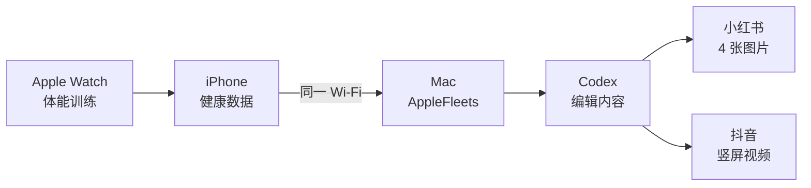

<p align="center">
  
</p>

<p align="center">
  Apple Watch 跑步结束后，由 Mac 上的 Codex 编辑内容，生成小红书图卡、抖音竖屏视频和两套文案。
</p>

<p align="center">
  <a href="https://github.com/JosephJagger/applefleets/actions/workflows/build.yml"></a>
  <a href="LICENSE"></a>
  
  
  
</p>

<p align="center">
  <a href="README.md">English</a> · <strong>简体中文</strong>
</p>

---

## 最终会得到什么

| 用途 | 生成内容 |
| --- | --- |
| 小红书 | 4 张 1080 × 1440 PNG 图片，以及标题、正文和话题 |
| 抖音 | 1 个 1080 × 1920、约 12 秒的 MP4，以及开场文案、正文和话题 |
| 编辑记录 | Codex 收到的内容、原始回答、最终方案和跑步摘要 |

Codex 会分析距离、配速、时长、心率和公里分段。它写出的封面标题和结尾总结会真正进入图片和视频，不只是额外生成一段文案。

## 工作流程



- 手表继续使用苹果自带的“体能训练”，无需安装新的 Watch App。
- GPS 坐标只在 iPhone 上计算，不会发送给 Mac 或 Codex。
- 生成结果保存在 Mac 的 `~/Movies/AppleFleets`。
- 发布前由你检查并确认，项目不会直接操作社交账号。

## 快速开始

> [!NOTE]
> 这个原型需要通过 Xcode 安装 iPhone App，第一次完整安装大约需要 30～60 分钟。

如果 Mac 已安装 Xcode、Homebrew 和 Codex，可以直接运行：

```bash
git clone https://github.com/JosephJagger/applefleets.git
cd applefleets
brew install xcodegen
xcodegen generate
open AppleFleets.xcodeproj
```

在 Xcode 中设置签名并把 App 安装到 iPhone，然后构建 Mac 工具：

```bash
cd Mac
swift build -c release
.build/release/applefleets demo --codex
```

如果这是你第一次使用 Xcode，请继续按照下面的完整步骤操作。

## 第一次安装

### 1. 准备设备

需要准备：

- 能把跑步记录保存到“健康”的 Apple Watch 和 iPhone；
- iOS 17 或更新版本的 iPhone；
- macOS 14 或更新版本的 Mac；
- Apple ID，以及首次连接 iPhone 使用的数据线。

在 Mac 打开 App Store，搜索并安装 **Xcode**。安装后打开一次，同意许可协议，并允许它安装附加组件。

按 `Command + 空格`，输入“终端”并回车，然后运行：

```bash
xcode-select -p
xcodebuild -version
```

第二条命令能显示 Xcode 版本，就可以继续。

### 2. 下载项目

点击本页面绿色的 **Code** 按钮，再点击 **Open with GitHub Desktop**；也可以在终端运行：

```bash
cd ~/Documents
git clone https://github.com/JosephJagger/applefleets.git
cd applefleets
```

下面默认项目位于 `~/Documents/applefleets`。如果你保存到了其他位置，请替换后续命令中的这个路径。

### 3. 安装 XcodeGen

先检查 Homebrew：

```bash
brew --version
```

如果提示找不到 `brew`，先按照 [Homebrew 中文官网](https://brew.sh/zh-cn/)安装。然后运行：

```bash
brew install xcodegen
cd ~/Documents/applefleets
xcodegen generate
open AppleFleets.xcodeproj
```

执行完成后会自动打开 Xcode。

### 4. 在 Xcode 中设置签名

1. 用数据线连接并解锁 iPhone；如果手机询问是否信任电脑，点击“信任”。
2. 在 Xcode 左侧点击蓝色的 **AppleFleets** 项目图标。
3. 在 **TARGETS** 下选择 **AppleFleets**。
4. 打开 **Signing & Capabilities**。
5. 勾选 **Automatically manage signing**。
6. 在 **Team** 中选择你的 Apple ID。
7. 把 **Bundle Identifier** 改成唯一名称，例如 `com.yourname.applefleets`。

如果 Team 中没有 Apple ID，打开 **Xcode → Settings → Accounts**，点击左下角 `+` 并登录。

### 5. 把 App 安装到 iPhone

1. 点击 Xcode 顶部的设备名称，选择刚才连接的 iPhone。
2. 点击左上角三角形运行按钮，或者按 `Command + R`。
3. 如果 iPhone 要求开启开发者模式，进入 **设置 → 隐私与安全性 → 开发者模式**，开启并重启手机，再回到 Xcode 运行。
4. App 第一次打开时，允许它读取健康数据并访问局域网。

AppleFleets 能显示跑步记录或打开示例页面，就说明 iPhone 端安装成功。

### 6. 安装并登录 Codex

先检查 Mac 是否能运行 Codex 命令：

```bash
codex --version
```

如果提示找不到命令，请按照 [OpenAI 官方 Codex CLI 安装说明](https://help.openai.com/en/articles/11096431)操作。已安装 Node.js 时也可以运行：

```bash
npm install -g @openai/codex
```

登录并检查状态：

```bash
codex login
codex login status
```

### 7. 生成一次示例内容

这一步使用内置示例，不需要读取 iPhone：

```bash
cd ~/Documents/applefleets/Mac
swift build -c release
.build/release/applefleets demo --codex
```

第一次编译可能需要几分钟。完成后 Finder 会自动打开结果文件夹，里面应该有：

```text
xiaohongshu-01.png      xiaohongshu.md
xiaohongshu-02.png      douyin.md
xiaohongshu-03.png      content-plan.json
xiaohongshu-04.png      codex-input.md
douyin-vertical.mp4     codex-output.json
workout.json
```

双击图片和视频，确认能够正常打开。

### 8. 配对 iPhone 和 Mac

1. 让 iPhone 和 Mac 连接同一个 Wi-Fi。
2. 在 iPhone 打开 AppleFleets，并保持页面亮着。
3. 在“连接 Mac”卡片中记下网址和六位配对码。
4. 把下面的示例网址与数字替换成手机显示的内容：

```bash
cd ~/Documents/applefleets/Mac
.build/release/applefleets pair http://192.168.1.20:8765 123456
.build/release/applefleets fetch
```

如果 `fetch` 显示包含 `distanceMeters` 和 `heartRate` 的跑步数据，说明连接成功。

### 9. 开启自动生成

普通网络环境运行：

```bash
cd ~/Documents/applefleets
./scripts/install-mac-agent.sh --codex
```

如果 macOS 询问是否允许传入网络连接，请点击“允许”。自动任务以后会随 Mac 登录启动，每 15 秒检查一次新跑步。

### Mac 使用 VPN 时怎么设置

**保持 VPN 开启。** 目标是让 Codex 继续通过 VPN 访问网络，同时让 iPhone 的局域网地址直接连接。

1. 在 VPN 软件中开启“允许局域网”“绕过局域网”或“排除私有地址”。不同软件名称可能不同。
2. 如果使用规则模式，把下面三个网段设置为 `DIRECT`：

```text
192.168.0.0/16
10.0.0.0/8
172.16.0.0/12
```

3. 完成直连规则后，可以直接安装后台任务：

```bash
cd ~/Documents/applefleets
./scripts/install-mac-agent.sh --codex
```

如果 VPN 软件还提供本地 **HTTP 代理端口**，可以使用隔离更清楚的方式：只把 Codex 的 HTTPS 请求送到这个端口。常见地址类似 `http://127.0.0.1:7890`，请以软件中显示的端口为准：

```bash
cd ~/Documents/applefleets
./scripts/install-mac-agent.sh --codex --proxy http://127.0.0.1:7890
```

这种方式会自动设置 `NO_PROXY`，确保本机和三个私有网段不进入代理。测试示例内容时可以运行：

```bash
cd ~/Documents/applefleets/Mac
HTTPS_PROXY=http://127.0.0.1:7890 NO_PROXY=localhost,127.0.0.1,.local .build/release/applefleets demo --codex
```

如果你的 VPN 只有全局/TUN 模式、没有 HTTP 代理端口，使用上面的 `DIRECT` 规则和普通安装命令即可。

## 平时怎么使用

1. 在 Apple Watch 使用系统“体能训练”记录并保存跑步。
2. 等待记录出现在 iPhone 的“健康”App 中。
3. 打开 AppleFleets，点击右上角“刷新”。
4. 保持 Mac 唤醒几分钟。
5. 打开生成目录：

```bash
open ~/Movies/AppleFleets
```

6. 检查图片、视频和文案，再通过 AirDrop 发到 iPhone 发布。

## 怎么确认 Codex 参与了编辑

打开本次结果中的 `content-plan.json`：

```json
"editor": "codex"
```

看到这个值说明本次内容由 Codex 编辑。如果显示 `local-template`，说明 Codex 当时运行失败，程序使用了本地备用模板。

| 文件 | 用途 |
| --- | --- |
| `codex-input.md` | 发送给 Codex 的跑步数据和编辑要求 |
| `codex-output.json` | Codex 返回的原始结构化结果 |
| `content-plan.json` | 图片和视频实际采用的内容方案 |
| `xiaohongshu.md` | 可复制的小红书成稿 |
| `douyin.md` | 可复制的抖音成稿 |

## 常见问题

<details>
<summary><strong>Xcode 显示红色签名错误</strong></summary>

进入 **AppleFleets → TARGETS → AppleFleets → Signing & Capabilities**，确认 Team 已选择 Apple ID、自动签名已经勾选、Bundle Identifier 是唯一名称。

</details>

<details>
<summary><strong>AppleFleets 看不到跑步记录</strong></summary>

先在 iPhone 打开 **健康 → 浏览 → 活动 → 体能训练**，确认跑步已经出现，再回到 AppleFleets 点击“刷新”。仍然没有时，进入 **设置 → 隐私与安全性 → 健康 → AppleFleets** 开启权限。

</details>

<details>
<summary><strong>iPhone 和 Mac 配对失败</strong></summary>

保持 iPhone 上的 AppleFleets 打开，并确认两台设备使用同一个 Wi-Fi、局域网权限已开启、网址与当前配对码完全一致。如果 Mac 使用代理或 VPN，请保持代理开启，并为上面的三个局域网网段添加 `DIRECT` 规则。

</details>

<details>
<summary><strong>跑完后没有自动生成</strong></summary>

查看后台日志，然后在手机中刷新：

```bash
tail -f "$HOME/Library/Application Support/AppleFleets/logs/watch.log"
```

按 `Control + C` 退出日志。如果仍然无效，重新安装自动任务：

```bash
cd ~/Documents/applefleets
./scripts/uninstall-mac-agent.sh
./scripts/install-mac-agent.sh --codex
```

使用本地 HTTP 代理端口时，按照“Mac 使用 VPN 时怎么设置”一节加上 `--proxy`。

</details>

<details>
<summary><strong>Codex 没有参与编辑</strong></summary>

```bash
codex login status
cd ~/Documents/applefleets/Mac
.build/release/applefleets demo --codex
```

查看终端错误以及结果目录中的 `content-plan.json`。

</details>

## 停止自动任务

```bash
cd ~/Documents/applefleets
./scripts/uninstall-mac-agent.sh
```

## 开发与贡献

```bash
# 生成并编译 iPhone 项目
xcodegen generate
xcodebuild build -project AppleFleets.xcodeproj -scheme AppleFleets \
  -destination 'generic/platform=iOS Simulator' CODE_SIGNING_ALLOWED=NO

# 测试 Mac 工具
cd Mac
swift test
```

更多资料：[系统架构](docs/ARCHITECTURE.md) · [参与贡献](CONTRIBUTING.md) · [第三方开源许可](THIRD_PARTY_NOTICES.md)

## 开源协议

AppleFleets 使用 [MIT License](LICENSE) 开源。第三方组件继续使用 [THIRD_PARTY_NOTICES.md](THIRD_PARTY_NOTICES.md) 中列出的许可证。
